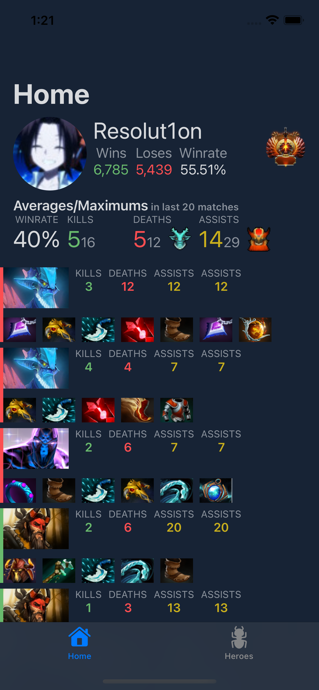
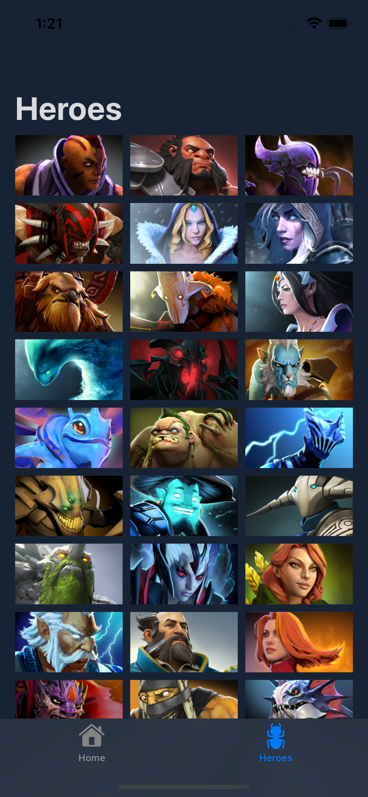
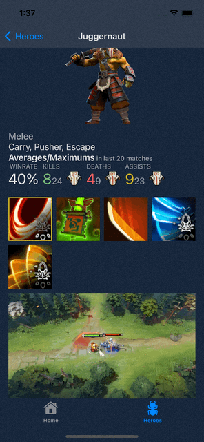

# Dota2Companion

Is a sideproject of mine, that I work on to learn SwiftUI and [CombineFeedback](https://github.com/sergdort/CombineFeedback)

## Architecutre
I try to follow [Clean Architecture](https://github.com/sergdort/CleanArchitectureRxSwift) that I've explored few years back

## Features

### User stats and recent performance

### Hero List

### Hero Details

